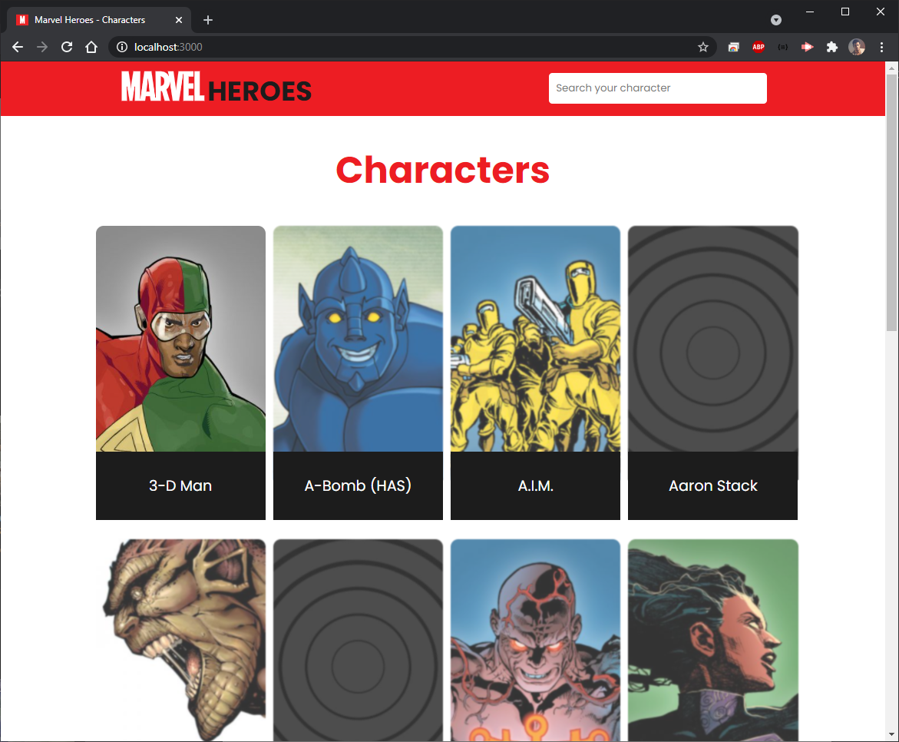

# Teste de Front-end para empresa brasileira

> Deploy: https://marvel-heroes-six.vercel.app/



## O Projeto 
> Consumir a API da Marvel e retornar os dados em tela de forma responsiva as funções* listadas abaixo:

 - [x] Mostrar os herois em forma de Card Template
 - [x] Funções de busca
 - [x] Detalhes do herois
 - [x] Resposividade
 - [x] Conceito B.E.M. para classes
 - [x] Organização de commits
 - [x] Versionamento com GitHub

**Algumas funções não foram mencionadas para preservar o teste da empresa.*

#
## Projeto desenvolvido em ReactJS
> Utilizado .env para preservação das keys *(para deploy de aplicação)*, dando versatilidade na reutilização do projeto por outros usuários. 

### Pacotes utilizados no projeto:
- [Axios]
- [React-Router-DOM]
- [React-Icons]
- [MD5]
- [Moment]

# Vídeos demonstrativos do resultado final do projeto.

## [Desktop REC]
[](https://www.youtube.com/watch?v=iUK8-3YVLjc)

## [Mobile REC]
[](https://www.youtube.com/watch?v=33tjxm1HZqo)

*Todos os direitos reservados* 

#
## Para instalar as dependências do projeto execute:

 ```
 npm install
 ```

 ## Para executar o projeto:

 ```
 yarn start
 ```

<!-- desktop https://youtu.be/iUK8-3YVLjc -->
<!-- mobile https://youtu.be/33tjxm1HZqo -->

  [Axios]: <https://github.com/axios/axios>
  [React-Router-DOM]: <https://github.com/ReactTraining/react-router>
  [React-Icons]: <https://react-icons.github.io/react-icons/>
  [MD5]: <https://www.npmjs.com/package/md5>
  [Moment]: <https://github.com/moment/moment/>

  [Desktop REC]: <https://youtu.be/iUK8-3YVLjc>
  [Mobile REC]: <https://youtu.be/33tjxm1HZqo>
  